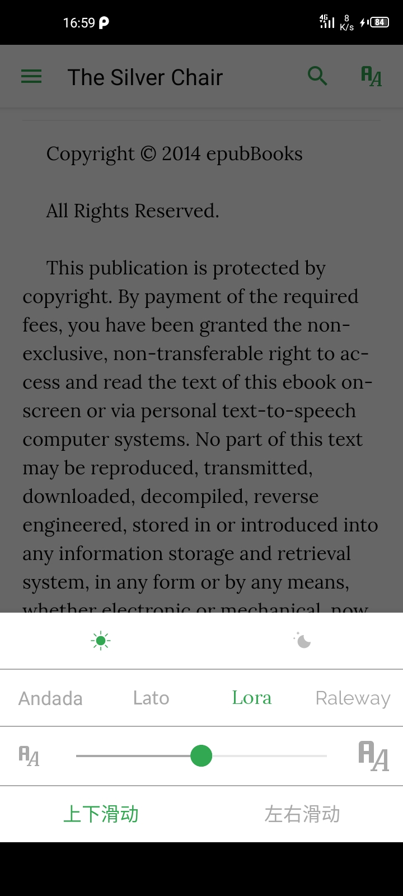

# Epub Viewer [](http://makeapullrequest.com) [](https://pub.dartlang.org/packages/epub_viewer)


a fork of [epub_kitty](https://github.com/451518849/epub_kitty) with few more features.
i made this out of epub_kitty because the author was inactive(he isn't merging PRs or attending to issues) and i started having alot of issues with the plugin

## ScreenShots
<table>
  <tr>
    <td align="center">
      
    </td>
    <td align="center">
      
    </td>
  </tr>
  <tr>
    <td align="center">
       
    </td>
    <td align="center">
       
    </td>
  </tr>
</table>


epub_reader is an epub ebook reader that encapsulates the [folioreader](https://folioreader.github.io/FolioReaderKit/) framework.
  It supports iOS and android, but is customizable on iOS. 
  It is very easy to use, you just need to set up the configuration file can open the ebook, very convenient.
  However, it is not yet highly customizable on android.
  But it has been able to meet daily needs.

## Install
```
dependencies:
  epub_viewer: latest_version
```

## Usage
```dart
/**
* @identifier (android useless)
* @themeColor
* @scrollDirection (android useless)
* @allowSharing (android useless)
*/
EpubViewer.setConfig("book", "#32a852","vertical",true);

/**
* @bookPath
* @lastLocation (optional and only android for now)
*/
EpubReader.open(
    'bookPath',
	lastLocation: {
        "bookId": "2239",
        "href": "/OEBPS/ch06.xhtml",
        "created": 1539934158390,
        "locations": {
            "cfi": "epubcfi(/0!/4/4[simple_book]/2/2/6)"
        }
    },
);

// Get locator which you can save in your database
EpubReader.locatorStream.listen((locator) {
   print('Locator: $locator');
   // convert locator from string to json and save to your database to be retrieved later
});
```

Check the [Sample](https://github.com/JideGuru/epub_viewer/tree/master/example) project or [this ebook app](https://github.com/JideGuru/FlutterEbookApp) for implementation
## Issues

If you encounter any problems feel free to open an issue. If you feel the library is
missing a feature, please raise a ticket on Github and I'll look into it.
Pull request are also welcome.

For help getting started with Flutter, view the online
[documentation](https://flutter.io/).

For help on editing plugin code, view the [documentation](https://flutter.io/platform-plugins/#edit-code).
	
